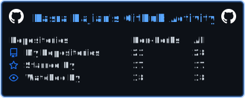
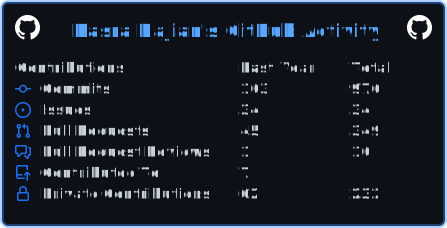

<h3> 👨🏻‍💻 &nbsp;About Me </h3>

Hi, I'm Kasra!

I'm a Computer Engineering graduate from [Sharif University of Technology](https://www.sharif.edu/). I have a strong passion for dissecting complex challenges and a deep curiosity for the realms of algorithms, artificial intelligence, and the fundamental principles of physics and astronomy.

My academic journey is complemented by nearly three years of practical software engineering experience at [Divar](https://divar.ir/s/tehran). I am always eager to learn, embrace new technologies, and contribute to impactful open source projects.

<!--  -->

